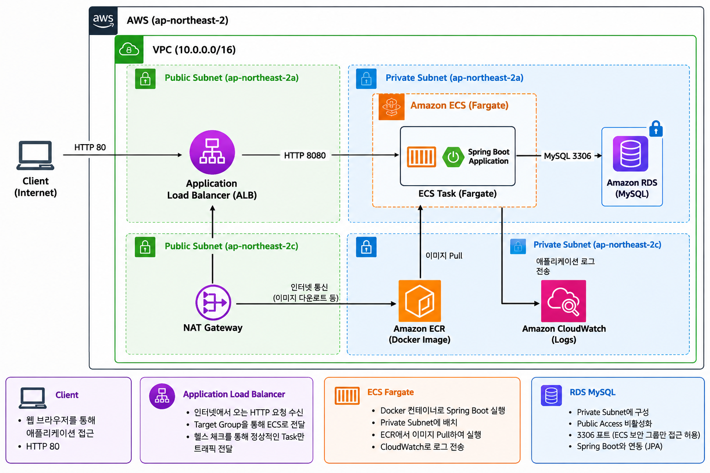
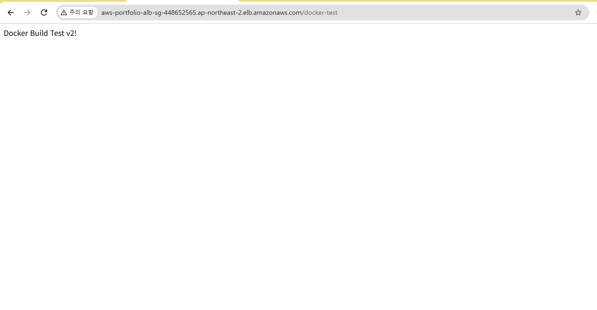
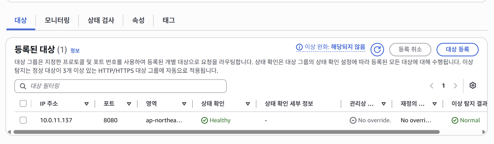
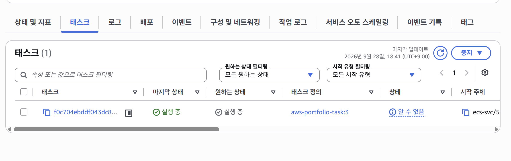
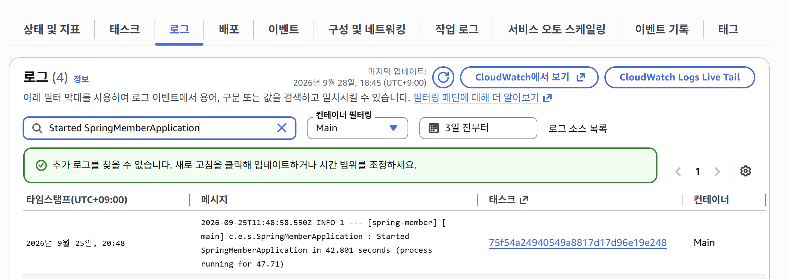

# AWS ECS Fargate 기반 Spring Boot 배포 프로젝트

Spring Boot 애플리케이션을 Docker 이미지로 빌드하고,
AWS ECR과 ECS Fargate를 이용하여 배포한 인프라 프로젝트입니다.

## Tech Stack

- **Cloud**: AWS VPC, ALB, ECS Fargate, ECR, RDS, CloudWatch
- **Backend**: Java, Spring Boot, Spring Data JPA
- **Database**: MySQL
- **Container**: Docker
- **Build**: Gradle
- **Version Control**: Git, GitHub

## Architecture

## AWS Infrastructure

- VPC: `10.0.0.0/16`
- Public Subnet
  - `10.0.1.0/24` (ap-northeast-2a)
  - `10.0.2.0/24` (ap-northeast-2c)
- Private Subnet
  - `10.0.11.0/24` (ap-northeast-2a)
  - `10.0.12.0/24` (ap-northeast-2c)
- Internet Gateway: Public Subnet 인터넷 연결
- NAT Gateway: Private Subnet의 아웃바운드 인터넷 통신
- ALB: Public Subnet에 배치
- ECS Fargate: Private Subnet에 배치
- RDS MySQL: Private 환경에 구성
- ECR: Docker 이미지 저장
- CloudWatch Logs: ECS 애플리케이션 로그

## Security

외부에서 애플리케이션 컨테이너와 데이터베이스에 직접 접근하지 못하도록
ECS Fargate와 RDS를 Private 영역에 구성했습니다.
인터넷 사용자는 ALB에만 접근할 수 있으며, ECS와 RDS는 Security Group 간 참조를 통해 필요한 트래픽만 허용하도록 구성했습니다.

- ALB SG: 인터넷에서 HTTP 80 허용
- ECS SG: ALB SG에서 오는 8080 포트만 허용
- RDS SG: ECS SG에서 오는 MySQL 3306 포트만 허용
- RDS Public Access: 비활성화

## Deployment

Spring Boot 애플리케이션을 Docker 이미지로 빌드한 후
Amazon ECR에 이미지를 저장하고 ECS Fargate를 통해 배포했습니다.

1. Spring Boot 애플리케이션 Gradle Build
2. Dockerfile을 이용하여 Docker Image 생성
3. Docker Image를 Amazon ECR에 Push
4. ECS Task Definition에 ECR Image 설정
5. ECS Service를 통해 Fargate Task 실행
6. ALB Target Group에 Task 자동 등록
7. Health Check 통과 후 외부 요청 전달

## Load Balancing

Application Load Balancer를 통해 외부 HTTP 요청을 받고,
Target Group을 통해 Private Subnet의 ECS Fargate Task로 요청을 전달했습니다.

- ALB Listener: HTTP 80
- ECS Container Port: 8080
- Target Group Health Check: `/docker-test`
- 정상적인 Task만 트래픽을 받을 수 있도록 Health Check 구성

## Database

Amazon RDS MySQL을 Private 환경에 구성하고
Spring Boot 애플리케이션에서 데이터베이스에 연결했습니다.

- Database: MySQL
- RDS Public Access: 비활성화
- Port: 3306
- RDS Security Group: ECS Security Group에서 오는 요청만 허용
- Spring Data JPA를 이용하여 데이터베이스 연동

## Monitoring

Amazon CloudWatch Logs를 이용하여 ECS Fargate에서 실행되는
Spring Boot 애플리케이션의 로그를 확인했습니다.

- ECS Task의 애플리케이션 로그 수집
- Spring Boot 시작 및 실행 상태 확인
- 배포 과정에서 발생하는 오류 확인
- 장애 발생 시 로그를 통한 원인 분석

## Troubleshooting

### Target Group Health Check 문제

**문제**

- ECS Fargate 배포 후 Target Group에 등록된 Task가 `Unhealthy` 상태로 표시됨
- ALB를 통한 애플리케이션 접근이 정상적으로 이루어지지 않음

**원인**

- Target Group의 Health Check 경로와 Spring Boot 애플리케이션의 실제 응답 경로가 일치하지 않음

**해결**

- Spring Boot 애플리케이션에서 HTTP 200 응답이 반환되는 경로를 확인
- Target Group의 Health Check 경로를 `/docker-test`로 변경

**결과**

- Target 상태가 `Unhealthy` → `Healthy`로 변경
- ALB를 통해 Private Subnet의 ECS Fargate 애플리케이션에 정상 접근 확인

### RDS 연결 문제

**문제**

- Private Subnet에 구성한 RDS MySQL에 애플리케이션에서 연결되지 않는 문제 발생

**원인**

- RDS Security Group의 Inbound Rule에서 MySQL `3306` 포트에 대한 접근 허용 설정이 올바르게 구성되지 않음

**해결**

- RDS Security Group의 Inbound Rule 확인
- MySQL `3306` 포트의 Source를 ECS Task가 사용하는 Security Group으로 설정
- RDS의 Public Access는 비활성화 상태로 유지

**결과**

- ECS Fargate의 Spring Boot 애플리케이션에서 RDS MySQL 연결 성공
- Spring Data JPA를 통해 `member`, `member_seq` 테이블이 생성되는 것을 확인

## Result

AWS 환경에서 Spring Boot 애플리케이션을 Docker 기반으로 배포하고
외부에서 ALB를 통해 정상적으로 접근할 수 있는 환경을 구성했습니다.

- Docker Image를 ECR에 저장
- ECS Fargate를 이용하여 Private Subnet에서 컨테이너 실행
- ALB를 통한 외부 HTTP 요청 처리
- Target Group Health Check `Healthy` 확인
- Spring Boot와 Private RDS MySQL 연동
- CloudWatch Logs를 통한 애플리케이션 실행 상태 확인

### Application Deployment Result

ALB를 통해 Private Subnet의 ECS Fargate에서 실행 중인
Spring Boot 애플리케이션에 정상적으로 접근되는 것을 확인했습니다.

### Target Group Health Check

ALB Target Group에 ECS Fargate Task가 등록되고,
Health Check 결과 `Healthy` 상태인 것을 확인했습니다.

### ECS Fargate Task

ECS Service에서 Fargate Task가 정상적으로 `Running` 상태로
유지되는 것을 확인했습니다.

### CloudWatch Application Logs

CloudWatch Logs를 통해 ECS Fargate 컨테이너의 로그를 확인하고,
Spring Boot 애플리케이션이 정상적으로 시작된 것을 확인했습니다.

## Future Improvements

실제 운영 환경을 고려하여 다음 항목을 추가로 개선할 수 있습니다.

- HTTPS 적용 및 ACM 인증서를 이용한 TLS 구성
- DB 비밀번호를 AWS Secrets Manager 또는 Parameter Store를 이용하여 안전하게 관리
- ECS Service Auto Scaling을 이용한 트래픽 기반 Task 자동 확장
- RDS Multi-AZ 구성을 통한 데이터베이스 가용성 향상
- CloudWatch Alarm을 이용한 장애 및 리소스 사용량 모니터링 강화
